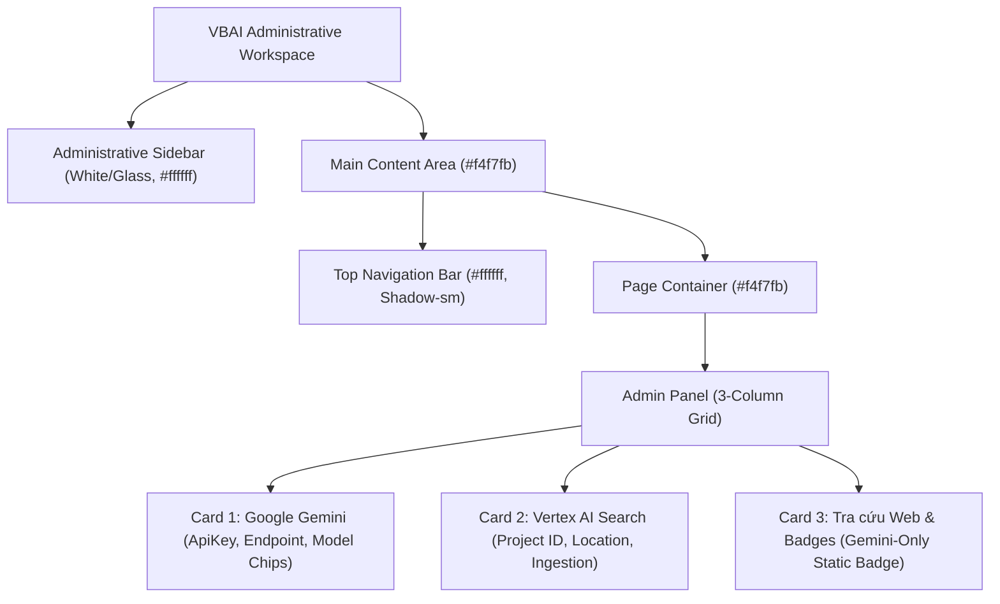

# Audit: Light Administrative UI Visual Walkthrough (VBAI V1)

## Overview
This visual walkthrough documents the completed migration from the legacy dark blue background theme to the **VBAI Light Administrative Theme** (`#f4f7fb` canvas, `#ffffff` card surface, `#2563eb` primary action accent).

---

## 1. Design System Tokens & Color Palette

| Token Name | Hex / Value | Usage Scope |
| :--- | :--- | :--- |
| `--bg-primary` | `#f4f7fb` | Main app background canvas |
| `--bg-secondary` | `#ffffff` | Top bar, modal headers, search panels |
| `--bg-card` | `#ffffff` | Feature cards, stats widgets, admin cards |
| `--bg-card-hover` | `#f8fafc` | Subtle hover state on cards and rows |
| `--surface-blue` | `#eff6ff` | Time badges, category tags, notice banners |
| `--border-subtle` | `#e2e8f0` | Card borders, section dividers |
| `--border-default` | `#cbd5e1` | Input fields, active section borders |
| `--border-focus` | `#2563eb` | Focused inputs, primary active states |
| `--text-primary` | `#0f172a` | Main headings, legal titles, body text |
| `--text-secondary` | `#334155` | Subtitles, labels, descriptions |
| `--text-muted` | `#64748b` | Timestamps, hints, footers |
| `--accent` | `#2563eb` | Primary buttons, active tab indicators |
| `--accent-hover` | `#1d4ed8` | Primary button hover |
| `--accent-soft` | `#dbeafe` | Selected options, focus rings |

---

## 2. Layout Structure & UI Modules

---

## 3. Key Administrative UI Enhancements
1. **Static AI Platform Badge**: Added `
Nền tảng AI: Google Gemini (Chính thức)
` in place of legacy provider choice radios.
2. **Clean Input Aesthetics**: Input fields feature white backgrounds (`#ffffff`), crisp `#cbd5e1` borders, and `#2563eb` focus rings with soft glow (`rgba(37, 99, 235, 0.15)`).
3. **No Theme Toggle**: Unified single light administrative design system across all modules without dark/light mode toggles.
